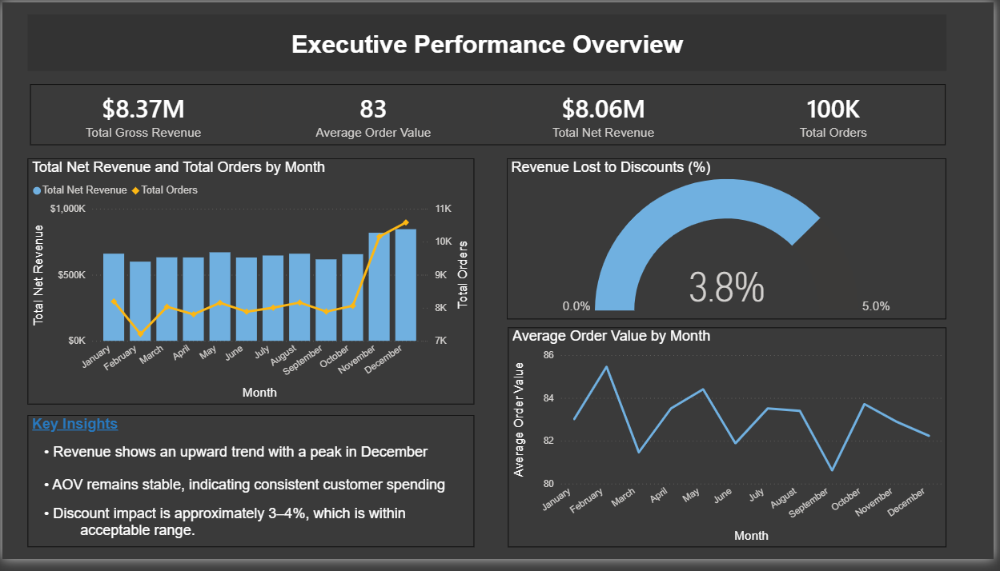
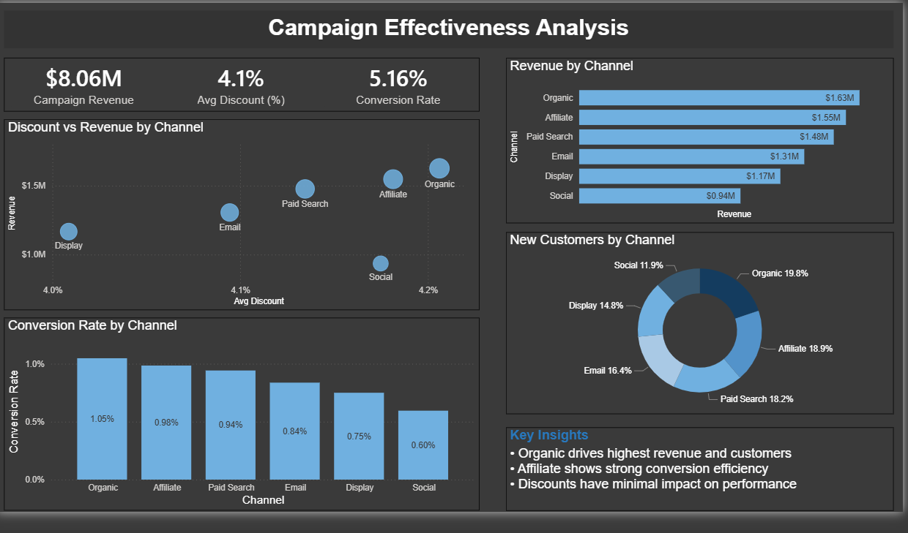
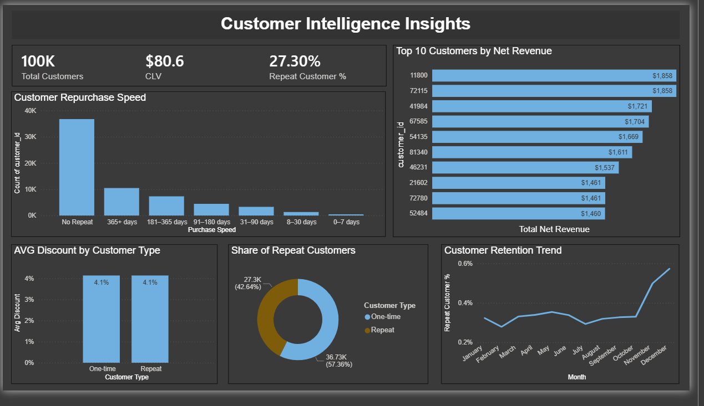
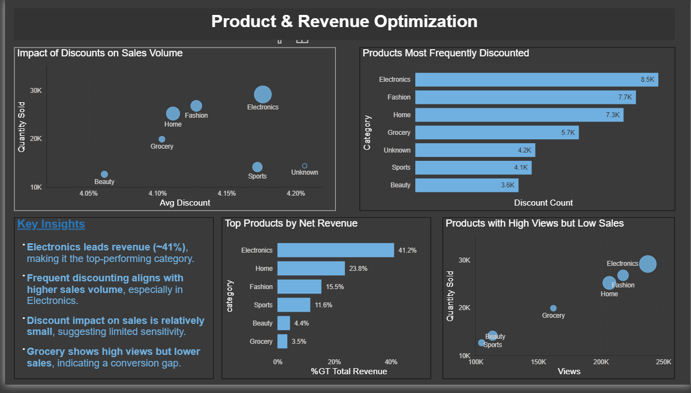
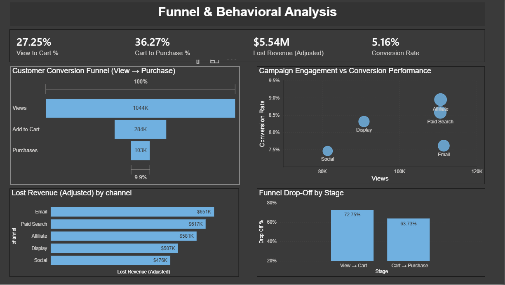

# 📊 Marketing & E-commerce Performance Analysis

## 🔍 Objective
This project analyzes marketing performance, customer behavior, and revenue trends to identify key growth opportunities and business inefficiencies. The goal is to provide actionable insights that can improve revenue, customer retention, and overall business performance.

---

## 🛠️ Tools Used
- Power BI  
- Microsoft Excel  

---

## ❓ Key Business Questions
- How has the business performed from 2021 to 2023?  
- What is the impact of discounts on revenue?  
- Which marketing channels drive the most revenue and conversions?  
- Where are customers dropping off in the purchase funnel?  
- What are the biggest opportunities for business growth?  
- Where is the business potentially losing revenue?  

---

## 📊 Dashboard Overview

### 1. Executive Performance Overview
Provides a high-level summary of revenue, total orders, and overall business performance trends over time.

### 2. Campaign Effectiveness Analysis
Evaluates marketing channel performance, including revenue contribution, conversion rates, and the impact of discounts.

### 3. Customer Intelligence Insights
Analyzes customer behavior, repeat purchase rates, and retention patterns to understand long-term customer value.

### 4. Product & Revenue Optimization
Identifies top-performing product categories, discount patterns, and highlights areas with strong demand but low conversion.

### 5. Funnel & Behavioral Analysis
Examines the customer journey from product view to purchase, identifying major drop-off points and revenue loss.

---

## 📈 Key Insights

- Revenue shows a steady upward trend with peak performance in December  
- Discounts have minimal impact on revenue (**~3–4%**)  
- Organic and Affiliate channels drive the highest revenue  
- Customer retention is relatively low (**~27%**), indicating missed long-term value  
- Significant drop-offs occur in the conversion funnel (View → Cart → Purchase)  
- Estimated revenue loss is approximately (**$5.5M**) due to funnel inefficiencies  
- Some product categories (e.g., Grocery) show high views but low conversion  

---

## 💡 Strategic Recommendations

### 1. Improve Customer Retention
Encourage repeat purchases through customer engagement strategies such as follow-ups, personalized communication, and incentives for returning customers.

### 2. Optimize Marketing Channels
Focus on high-performing channels (Organic, Affiliate) and improve or reduce investment in underperforming channels like Social.

### 3. Improve Funnel Conversion
Reduce drop-offs by optimizing the customer journey between product views, cart additions, and purchases.

### 4. Apply Discounts Strategically
Limit broad discounting and focus on targeted promotions where they provide the most value.

---

## 🧾 Conclusion
This analysis shows that the biggest opportunities for growth lie in improving customer retention and optimizing the conversion funnel. Rather than relying heavily on discounts, the business can increase revenue more efficiently by enhancing customer experience and focusing on high-performing marketing channels.

By addressing these areas, the business can unlock significant revenue potential and improve overall efficiency.

---

## 🖼️ Dashboard Preview

### Executive Overview

### Campaign Analysis

### Customer Insights

### Product Optimization

### Funnel Analysis

---

## 📌 Project Status
Completed – Ready for portfolio presentation